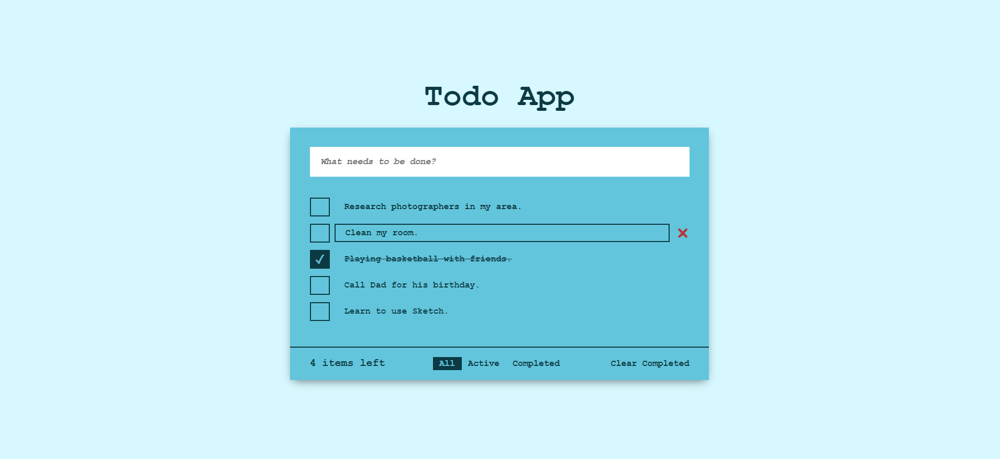

# <h1 align="center">React - Todo App 📝</h1> 

<p align="center">A simple Todo App built using ReactJS.</p>



## 💎 Features

<ul>
  <li>✖️ Add todos</li>
  <li>✏️ Edit todos</li>
  <li>🗑 Delete todos</li>
  <li>🔍 Filter todos</li>
</ul>

## 💻 Live Demo

Check the live demo here 👉 [Demo](https://todo-app-kaderbrl.vercel.app/) 

## 📋 Instructions

First clone this repository.

```shell
git clone https://github.com/kaderbrl/todo-app-react.git
```

Install dependencies. Make sure you already have [`node.js`](https://nodejs.org/en/) & [`npm`](https://www.npmjs.com/) installed in your system.

```shell
$ npm install # or yarn
```

Run it.

```shell
$ npm start # or yarn start
```

## Languages and Tools

<p align="left">
  
  
  
  
  
</p>
